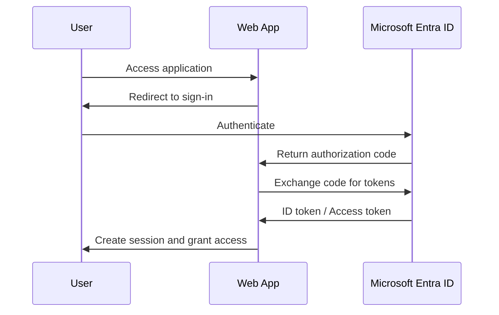
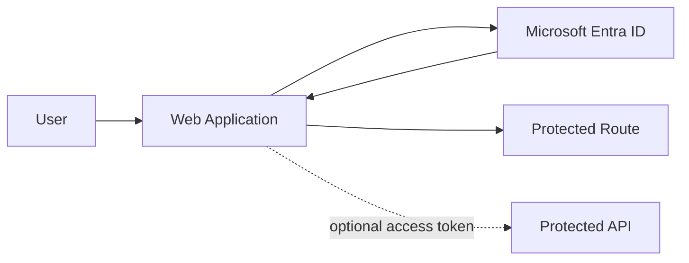

# Entra OIDC Troubleshooting Lab

## 📌 Overview

This project demonstrates a simple end-to-end OpenID Connect (OIDC) authentication flow using Microsoft Entra ID.

The goal is to understand how authentication works in modern cloud environments and to explore common issues related to identity flows, sessions, tokens, and integrations.

---

## 🎯 Objectives

* Understand OAuth2 and OpenID Connect authentication flows
* Implement a basic login flow using Microsoft Entra ID
* Analyze ID tokens and access tokens
* Simulate and troubleshoot common authentication issues
* Document real-world troubleshooting scenarios

---

## 🏗️ Architecture

User → Web App → Microsoft Entra ID → Web App (callback) → Protected Resource

### Flow Summary:

1. User accesses the web application
2. The app redirects the user to Microsoft Entra ID
3. User authenticates
4. Entra ID returns an authorization code
5. The application exchanges the code for tokens
6. The user session is created
7. The app uses the access token (optional) to call APIs

   ## Authentication Flow Diagram



## High-Level Architecture




---

## 🔐 Authentication Concepts

### OAuth2 vs OpenID Connect

* OAuth2: Authorization framework (access to resources)
* OpenID Connect: Authentication layer on top of OAuth2

### Tokens

* ID Token → used for authentication (who the user is)
* Access Token → used to access APIs
* Refresh Token → used to renew sessions (optional)

---

## ⚙️ Technologies Used

* Microsoft Entra ID (Azure AD)
* OpenID Connect / OAuth2
* Node.js (or your stack)
* MSAL (Microsoft Authentication Library)

---

## 🚀 Getting Started

### 1. Register Application in Entra ID

* Go to Azure Portal → App registrations
* Create a new app
* Set redirect URI (e.g. http://localhost:3000/auth/callback)
* Note Client ID and Tenant ID

### 2. Configure Environment Variables

Create a `.env` file:

CLIENT_ID=your-client-id
TENANT_ID=your-tenant-id
REDIRECT_URI=http://localhost:3000/auth/callback

### 3. Run the App

```bash
npm install
npm start
```

## 🔍 Troubleshooting Scenarios

This project covers common identity-related issues such as:

- Redirect URI mismatch  
- Invalid client secret  
- Session persistence issues  
- Wrong token audience  

👉 See full details here:  
[Troubleshooting Scenarios](docs/troubleshooting-scenarios.md)

---

## 📊 Key Learnings

* Authentication issues are often caused by misconfigurations, not failures of the identity provider
* Tokens and sessions must be handled correctly across applications
* End-to-end visibility is critical in integrated environments

---

## 📁 Project Structure

```bash
.
├── app/
├── docs/
├── diagrams/
└── README.md
```

---

## 🔮 Next Steps

* Add Azure AD B2C support
* Integrate a protected API
* Simulate multi-application SSO flow
* Add logging and monitoring for authentication events

---

## 🧠 Interview Notes

This project can be used to demonstrate:

* Understanding of OAuth2 and OpenID Connect
* Troubleshooting identity flows
* Experience with Entra ID authentication
* Ability to analyze real-world authentication issues
